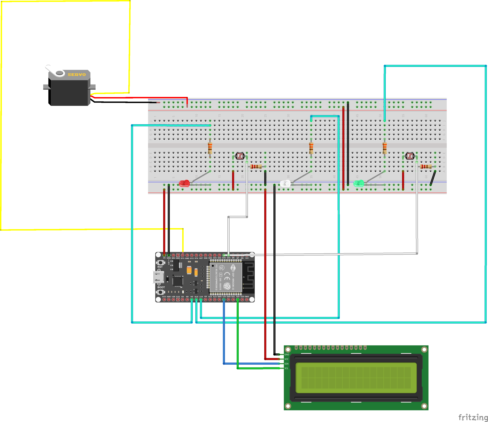
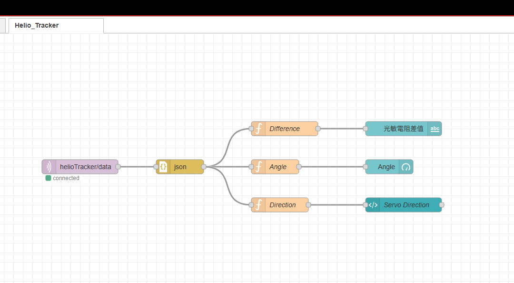
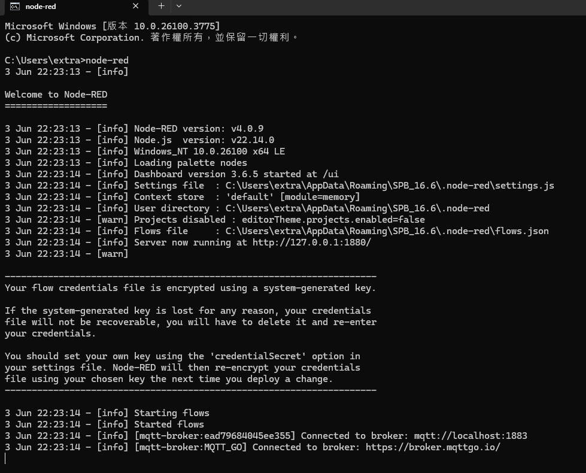
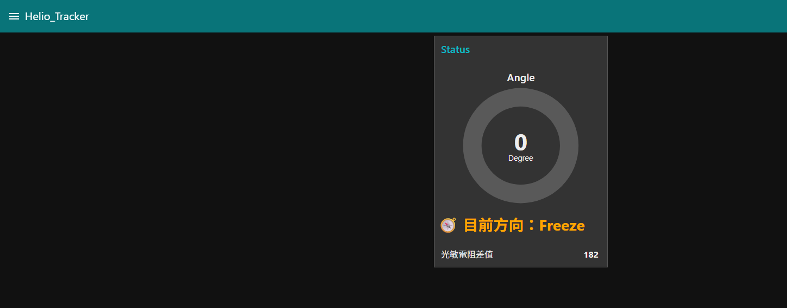
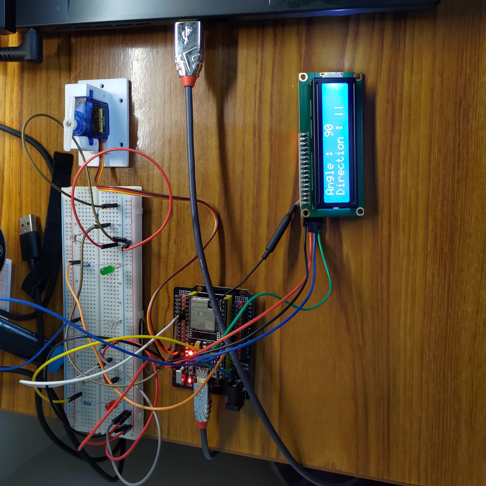

# Helio_Tracker

是一個使用 ESP32 + 光敏電阻 + 伺服馬達的光追蹤系統。
透過 MQTT以及Node-RED 儀表板實現即時資料視覺化。

A light tracking system using ESP32 + photoresistors + servo motor.  
Realtime data visualized via Node-RED dashboard over MQTT.

# 使用方式

環境準備
1. 開啟 Arduino IDE, 設定 WiFi & MQTT
參考 ESP32/ 資料夾內的 .ino 檔案，設定WiFi & MQTT Broker並燒錄至 ESP32。

2. 接線參考
請依據 Images/ 資料夾內的接線圖進行連接，特別注意以下幾點：

4. Node-Red 簡易安裝 & 專案參數設定((詳細的Node-Red 安裝和操作請自行Google)
因為是以 Node.js 為基礎，所以要使用前必須要安裝 Node.js，直接前往 Node.js 官方網站下載安裝。(https://nodejs.org/zh-tw)
安裝 Node.js 完成後，打開終端機，輸入 npm install -g node-red 就可以完成 Node-RED 的安裝

更多細節請參考Images/Node_Red_Setting資料夾

注意事項

1. 我有另外搭配ESP32 IO Shield Board, 所以如果沒有這塊擴展板
LCD 1602 模組, ESP32 I2C預設接的腳位是 SDA=>GPIO21, SCL=>GPIO22
  
2. LED 有限流電阻, 
詳細接線請參見 Images/ 接線圖

3. Node-Red更動後要按右上角Deploy才會生效

測試流程建議

1. 確認接線無誤並燒錄韌體

2. WiFi有連接到才會在LCD上顯示資訊, 可以用Arduino IDE內建Terminal觀察連線情況

3. 確認有連接到MQTT Broker, 訂閱Topic程式碼內建是helioTracker/data (可以在程式碼改成自己喜歡的)

4. 打開CMD, 輸入 node-red就會在本機開啟(詳細的Node-Red 安裝請自行Google)
   
   

5. 打開瀏覽器輸入127.0.0.1:1880 & 127.0.0.1:1880/ui, 即可開啟Node-Red & Dashboard(詳細的Node-Red操作請自行Google)
   
   
   
   

# 功能說明

1. OLED 顯示 => 顯示目前SG90角度和目前轉動方向(<<<, >>>, ||)

2. 紅燈亮表示伺服馬達朝左邊轉動, 綠燈亮表示朝右邊轉動, 白燈閃爍代表停止狀態

# 使用技術與工具

**IDE**: 
   
1. Arduino IDE

**Hardware**: 

1. ESP32-Wroom-32UE Board x1

2. ESP32 IO Shield Board x1 (Optional)
 
3. LCD 1602 Module x1
 
4. SG90 x1
 
5. Photoresistor x2
 
6. LED:
    – Red ×1
    – Green ×1
    – White ×1

7. Resistors:
    – 220 Ω ×2
    – 330 Ω ×3

8. Breadboard ×1

9. Jumper Wires: Male-to-Male, Male-to-Female (Depending on connection)

10. Bracket: For fixing SG90(Made with 3D Printing. It depends) 

**Software**:

1. Node-Red

**Knowledge:**

1. MQTT

2. Node-Red 
   
3. C Programming Language

4. Median Calculation

5. Bubble Sort

# 開發過程重點

1. 實作MQTT & Node-Red整合使用，從數據轉成圖案更符合視覺動物的喜愛(?)。

2. 導入前30筆資料結合氣泡排序法計算中位數當作Baseline，降低不同環境下光源不同的影響。

3. LCD藍底白字即時顯示馬達角度與追蹤方向，配色很有Windows當機風格(?) 

***所有零件皆為常見開發模組，適合初學者搭建與測試***

# 成果展示

點擊下方觀看實際操作影片，展示伺服馬達追隨光源方向轉定並同步在Node-Red視覺化Dashboard：

Node-Red Dashboard

實體接線圖

# 授權
***本專案以 MIT License 授權開源使用。***
